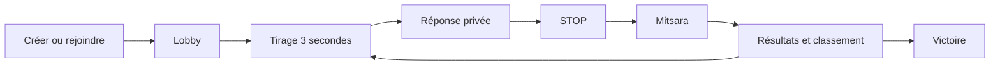

# Règles retenues

## Partie

- 2 à 12 joueurs. Les entrées sont possibles dans le lobby uniquement. Recharger la page reprend sa place avec le jeton local ; quitter explicitement révoque la place.
- 200 points, 15 secondes, 10 points pour une bonne réponse unique et 5 pour un doublon par défaut. Tous ces paramètres se règlent à la création, dans les limites affichées.
- Les catégories suivent l’ordre du PDF : prénom masculin, prénom féminin, plante, fruit, artiste malgache, artiste international, lieu à Madagascar, lieu à l’étranger. Puis le cycle recommence.
- Trois secondes d’animation précèdent la fenêtre de réponse. Le serveur refuse les envois avant son début et à partir de son échéance.
- Les lettres sont choisies par le serveur. En mode sans répétition, le jeu épuise le jeu de lettres avant de recommencer un cycle.

## Validation

- Une réponse vide, commençant par une autre lettre, ou signalée en mode strict reçoit automatiquement zéro.
- La casse, les accents et les espaces supplémentaires sont ignorés pour comparer les doublons. Les signes de ponctuation restent significatifs.
- Chaque participant vote une seule fois par réponse, avec modification possible jusqu’à la clôture. Il ne peut pas voter pour lui-même.
- **Incertain** compte comme participation mais pas comme vote pour ou contre. La majorité est le nombre de votes valide comparé au nombre de votes incorrect.
- Le jugement peut être clôturé lorsque tous les joueurs présents ont voté ou après 30 secondes. Les votes absents valent abstention.
- À égalité, le maître du jeu arbitre. Pour sa propre réponse, le premier autre participant encore connecté arbitre. Si aucun n’est disponible après le délai, cette réponse reçoit zéro pour éviter un blocage et une auto-validation.
- Les doublons sont comptés parmi les réponses finalement acceptées uniquement.
- Le calcul des points est transactionnel et ne peut être effectué qu’une fois par manche.
- Si plusieurs joueurs sont à égalité en tête au-dessus de l’objectif, tous poursuivent une nouvelle manche jusqu’à obtenir un leader unique.

## Présence et anti-triche

- Le navigateur envoie un signal de présence à chaque lecture périodique. Après 45 secondes sans signal, le joueur est absent. Le rôle de maître du jeu passe au premier joueur connecté.
- Un nouvel onglet qui reprend une place invalide l’identifiant de session précédent. Les réponses et les actions de l’ancien onglet sont refusées ; les notifications WebSocket ne contiennent aucune donnée privée.
- Une sortie de l’onglet ou une perte de focus pendant le temps de réponse crée un événement horodaté par le serveur. Les signaux blur/visibilitychange sont fusionnés pour ne pas compter deux fois la même sortie.
- **Souple** : journal uniquement. **Normal** : avertissement visible pendant le jugement. **Strict** : réponse annulée.
- Le serveur impose échéance, lettre et scores. Les signaux navigateur ne prouvent pas à eux seuls une triche et ne permettent pas de détecter un second appareil.

## Parcours

